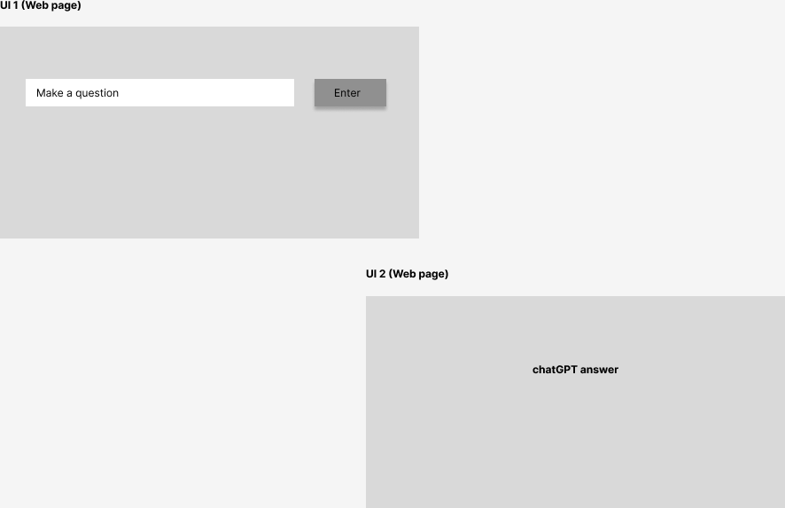

# ChatBot (from chatgpt api)
## ChatGPT API 이용한 웹 챗봇서비스
1. 웹에서 구동되는 chatbot 개발: 03.13-03.15
2. chatbot 답변 파일로 저장 가능하게끔 구현: 03.17-03.19

### 기능
1. ChatGPT API를 이용한 웹 챗봇서비스
2. 챗봇 질문 입력 시 받은 답변 txt 파일로 다운로드

### 파일 
- Local chatbot (웹서비스 구현 전 테스트용으로 작성한 파일들)
   - local/chatgpt_local.py (코드), local/chat_local.txt (결과파일)
- Web chatbot
   - result/chat.py, result/index.html (코드), result/chat_web.txt (결과파일)

### 시안

### ❗주의사항❗
- 키, 암호 등 민감한 정보는 github에 업로드가 불가능하다 한다.
- 즉, <b>해당 코드는 로컬에서만 테스트 가능하다.</b>